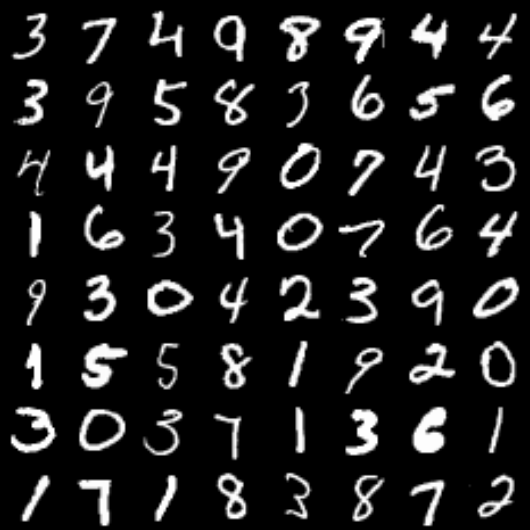
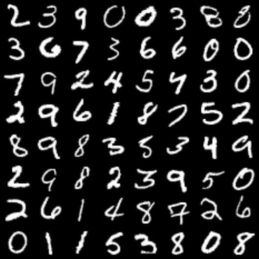
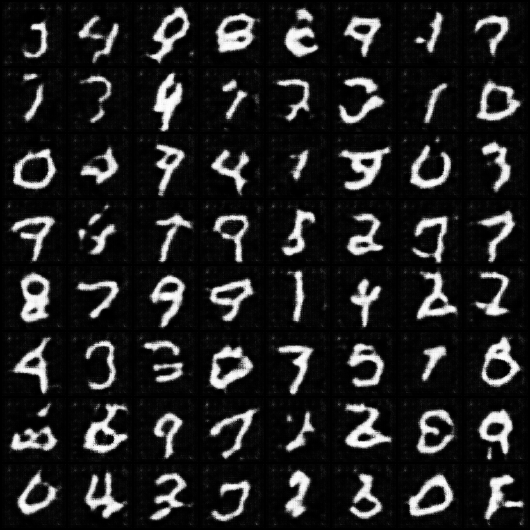

# Deep Convolutional Generative Adversarial Network  
## About
**DCGAN(Deep Convolutional Generative Adversarial Network)** is an architecture used to generate new content.   
### Architecture  
DCGANs comprises of two neural networks, **Generator** and **Discriminator**. **Generator** generates a fake image and has no   
prior knowledge of real image. It interacts with the **Discriminator** in order to learn what kind of image it needs to generate.

**Discriminator** is a classifier which determines whether an image is fake or real. **Discriminator** neural network is fed with  
both real(given by user) and fake images(generated by **Generator**), and it is then trained to accept the real images and reject  
the fake images.  

Main purpose of **Generator** is to fool the **Discriminator** Neural Network by generating fake images and make the **Discriminator**
classify them as real images.

**Discriminator** neural network in this repository take images from MNIST dataset<Hand Written Digits> as real image input and **Generator** tries to generate fake hand written digits.
## Requirements
* Python 2.7
* Pytorch *(works perfectly on pytorch version 0.4.0)*
## Usage  
* Run the `python main.py` after cloning or downloading the repository .  
## Result  
### Generated Image MNIST dataset
<table align='center'>
<tr align='center'>
<td> Real Image </td>
<td> Fake Image at 20th epoch</td>
<td> Fake Images During Training </td>
</tr>
<tr>
<td>
<td>
<td>
</tr>
</table>

